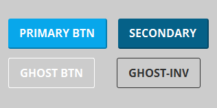

footer: © Felipe Peña - Two Tall Totems
slidenumbers: true

#### Say goodbye to **messy** CSS stylesheets#
#**Welcome** Tailwind :wave: 

--- 

# Most **common** approaches

--- 

##**Several** stylesheets for different sections of a site

---
##index.html

1. css/app.css
1. css/mobile.css
1. css/tablet.css
1. css/new_section.css

--- 

## ❗ Styles are **spread** over different sheets.

---

## ❗️️️ **Long** CSS sheets.

---

## ❗️️️ Hard to reuse over different projects.

---

#**Separation** of concerns

---

#HTML **vs** CSS

---

#Class names are **related** to content

---

```css
.author-bio-name {
	margin-top: 10px;
	color: #443123
}

.profile-container {
	padding: 8px;
	border-type: solid;
	display: flex;
}

```

---

#CSS classes **are not** agnostic

---


#**CSS** Frameworks

--- 

##Bootstrap
##**Bulma**
##Foundation
##**Semantic UI**

---

## ❗️️️ They come with **predefined** UI.

---

## ❗️️️ **Tied** to Javascript libraries.

---

## ❗️️️ Require **override** styles for custom UI

---

##Can we find an **agnostic** framework? 
#🤔

---

##**Tailwind:** A Utility-First CSS Framework for Rapid UI Development

--- 

#WHAT? 🤨

--- 

## ✅ No default theme.
## ✅ No UI components.

---


#**No** opinion! 👈🏻

---

## ✅ Low level **utility** classes.

---
| Tailwind | CSS |
| --- | --- |
| m-3 | margin: 0.75rem |
| ml-3 | margin-left: 0.75rem |
| mr-3 | margin-right: 0.75rem |
---
| Tailwind | CSS |
| --- | --- |
| w-auto | width: auto |
| w-48 | width: 12rem |
| w-1/2 | width: 50% |
---
| Tailwind | CSS |
| --- | --- |
| bg-red | background-color: red |
| text-red | color: red |
| border-red | border-color: red |
--- 

## ✅ Component **friendly**.

---

#Primary button
<br/>
<br/>


---
[.code-highlight: all]

```scss
.btn {
	@apply .font-bold .py-2 .px-4 .rounded;
}
.btn-blue {
	@apply .bg-blue .text-white;
}

```
####...
[.code-highlight: none]
```html
<button class="btn btn-blue">
  Button
</button>
```
---
[.code-highlight: none]

```scss
.btn {
	@apply .font-bold .py-2 .px-4 .rounded;
}
.btn-blue {
	@apply .bg-blue .text-white;
}

```
####...
[.code-highlight: all]
```html
<button class="btn btn-blue">
  Button
</button>
```
---
#**DEMO** TIME
####Basic **example**
---
#**DEMO** TIME
####Intermediate **example**
---

#**Tailwind**
#Configuration

---

## 🎨 Colors and variants
## 📐 Spacing and sizes
## 💅🏻 Plugins

---

#**DEMO** TIME
####Advanced **configuration**

---

##[Twotalltotems/lunch-and-learn-1108](#https://github.com/Twotalltotems/lunch-and-learn-1108)
###**Github Repo**

---

#Thanks! 🤟🏻

---

#### Say goodbye to **messy** CSS stylesheets#
#**Welcome** Tailwind :wave: 